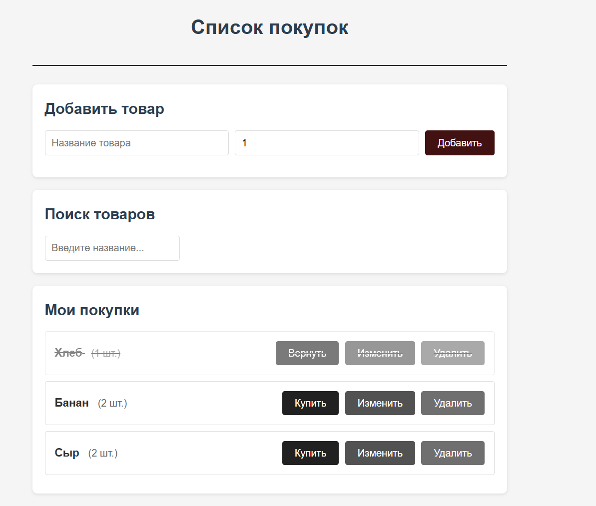
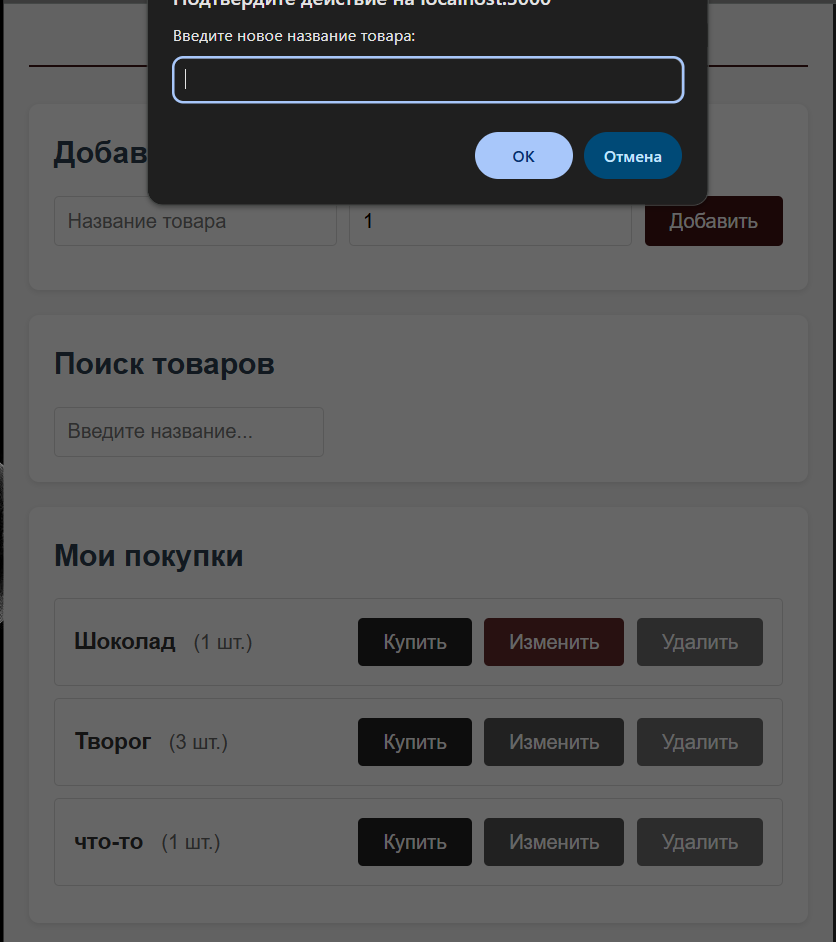
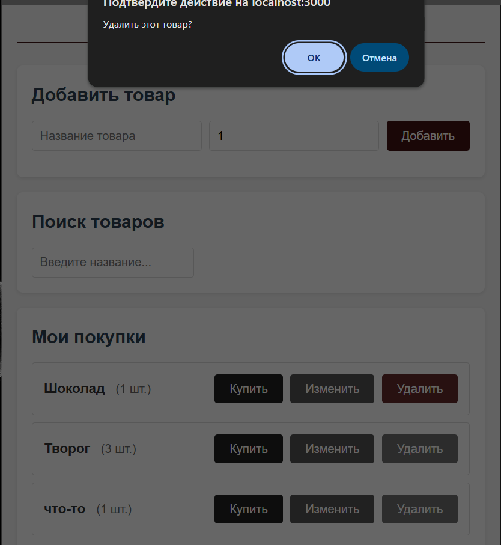
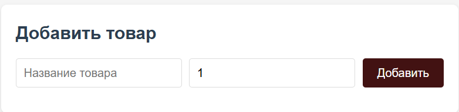
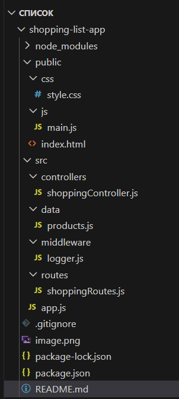

Список покупок

Простое веб-приложение для управления списком покупок, разработанное на Express.js. Позволяет добавлять, просматривать, редактировать и удалять товары из списка покупок.

Рисунок 1. Главная страница

Рисунок 2. Возможность менять добавленные в список продукты и их количество

Рисунок 3. Возможность удалять продукты из списка

Рисунок 4. Добавление товара и его количества

Рисунок 3. Структура проекта в VS Code

Все требования реализованы:
1 Базовый Express-сервер (Реализовано в server.js)

2 Полный CRUD реализован в src/routes/productsRoutes.js:

GET /api/products - получить все товары из списка покупок

GET /api/products/search - поиск товаров по названию (query параметры)

GET /api/products/:id - получить конкретный товар по ID

POST /api/products - добавить новый товар в список

PUT /api/products/:id - обновить информацию о товаре

PATCH /api/products/:id/toggle - переключить статус "куплено/не куплено"

DELETE /api/products/:id - удалить товар из списка

3 Работа с параметрами запросов 
req.params - для получения ID товара (:id)
req.query - для параметров поиска (?query=молоко&purchased=false)
req.body - для получения данных из тела запроса при создании/обновлении

4 Обработка тела запроса В server.js добавлены: app.use(express.json()); // для JSON данных app.use(express.urlencoded({ extended: true })); // для form-data

5 Собственный middleware Реализован middleware/logger.js и подключен в server.js

6 Раздача статических файлов В server.js: app.use(express.static(path.join(__dirname, '../public')));
Все файлы из папки public/ (HTML, CSS, JS) доступны по корневому URL.

7 Логика разнесена по модулям src/routes/productsRoutes.js - маршрутизация API endpoints

src/controllers/productsController.js - бизнес-логика обработки запросов

src/middleware/logger.js - промежуточные обработчики

src/data/products.js - временное хранилище данных

src/server.js - конфигурация и запуск сервера

